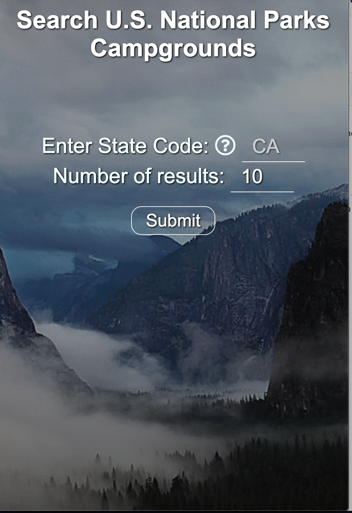
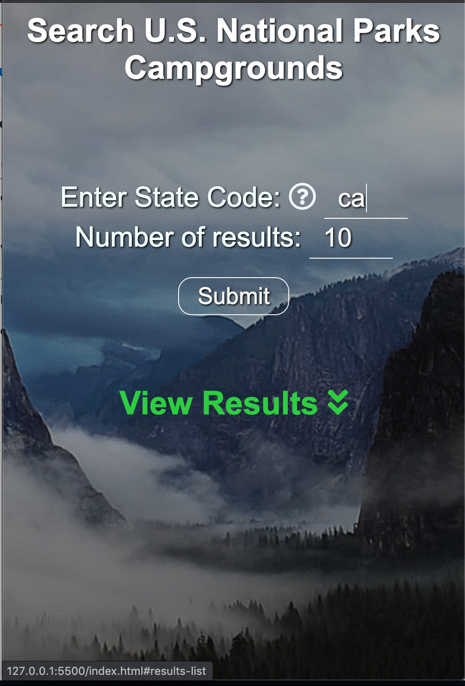
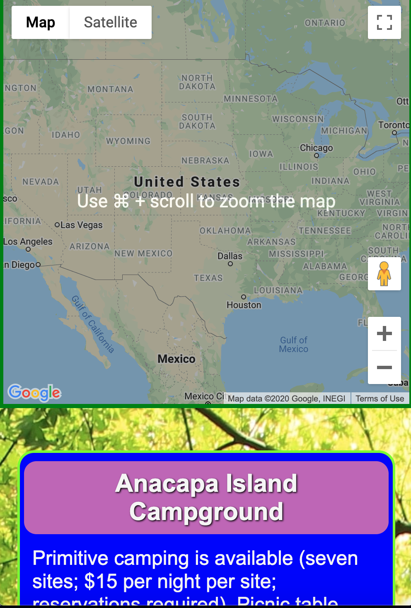
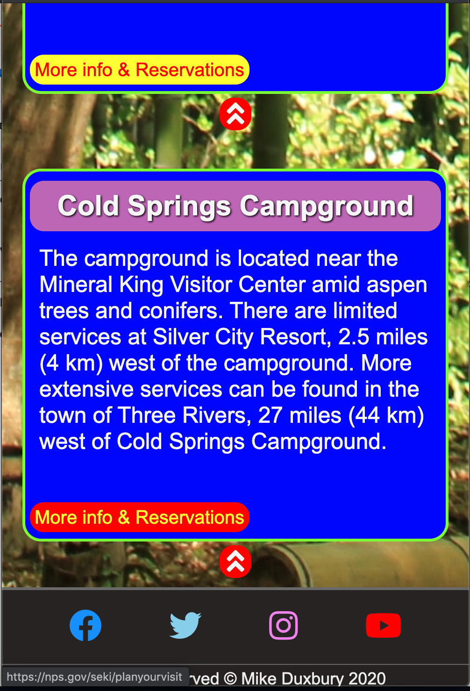

# campgrounds-api
My first capstone project to find National Park campgrounds by state using the National Parks API.

## Motivation

I wanted a campsite search app that would return a list of campsites with information and reservation links from any state you are visiting.

## Live App

https://miked5886.github.io/campgrounds-api/

## Screenshots
Landing Page:

Search screen:

Map:

Results & Footer:

## Built With

### Front-End
* HTML
* CSS
* Javascript
* J-Query

## Features

* Search for list of campsites by state
* Use map to take a closer look at sites and surrounding area
* See discriptions of capsites along with links to webpages.
* Links to National Parks Social media accounts
